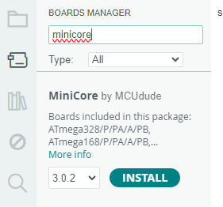
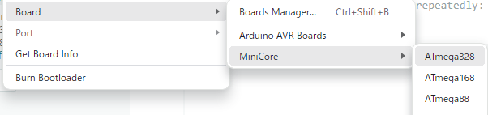
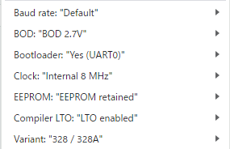
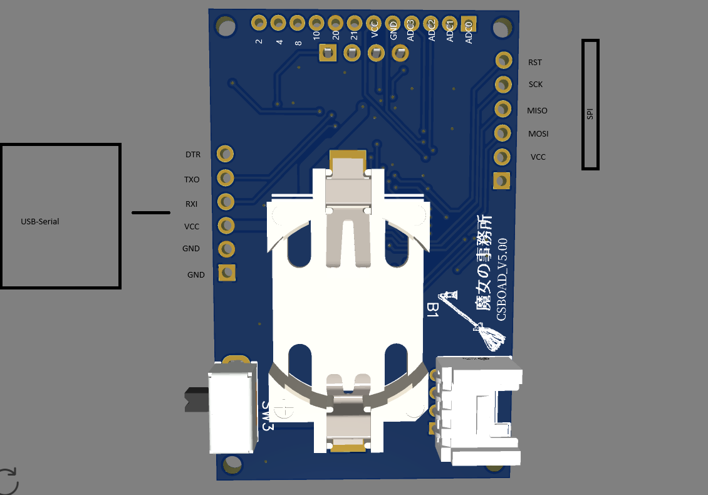

# ねこのばしポータブル取扱説明書
## 構成
| Status | Value |
| --- | --- |
| Core | ATMEGA328 |
| ファームウェア | Arduino Mini Core |
| バッテリー | CR2032 |
| ディスプレイ | SSD1306 (128*64) |
| ボタン | SKRHADE010 (上下左右押し込み)|
| スピーカ | ピエゾ素子 |
| 外部コネクタ | Grove(i2c) SSD1306と同じチャンネル |
## 操作方法
ボタンを押し込むと猫がのびて、
ボタンを離すと占いの結果を持ってきてくれます。
## プログラムの書き換え
別売りのUSB-Serial変換基板を使って、ArduinoIDEからプログラムの書き込みができます。
## できること
### 画面表示
SSD1306はi2cに接続されています。
### ボタン認識
ボタンの機能はそれぞれのGPIOに接続されています。
### スピーカ出力
スピーカはGPIOに接続されています。
# ArduinoIDEでの開発
※書き込みには別途、USB-Serial基板が必要です。

1. 設定から、以下のボードマネージャURLを追加します。
https://mcudude.github.io/MiniCore/package_MCUdude_MiniCore_index.json

    

2. ボードマネージャから、「Mini core」を検索して追加します。

    

3. 開発時のボードは、Atmega328を選択します。

    

4. そのほかの設定は以下の通りです。

    

    詳細な設定は公式を参照ください。
    https://github.com/MCUdude/MiniCore

5. USB-Serialを介して書き込みます。
書き込みが失敗するようでしたら
    - 書き込みの直前にリセットボタンを押す
    - ボードをAtmega328Pにして再度書き込み

    以上の2点を試してみてください。

## ピンアサイン
裏のカバーを外したほうから見た図

# Author
 
* 作成者 ささみ
* Twitter https://x.com/sasami0709
* Website https://chokhmah.lol/

# This page

